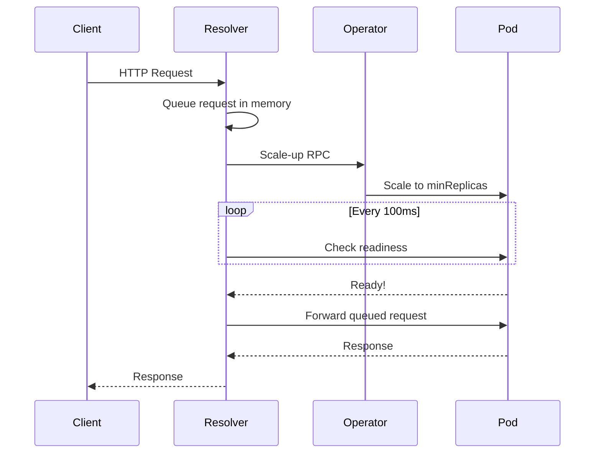
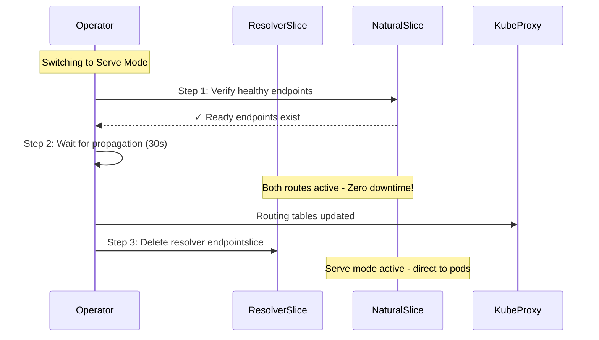

# Zero-Downtime Architecture

KubeElasti implements comprehensive zero-downtime mechanisms to ensure **no requests are dropped** during scale-up operations, from the first incoming request through the complete transition to serve mode.

## Overview

Zero-downtime is achieved through three complementary mechanisms:

1. **Request Queueing** - Holding requests in memory while pods start up
2. **Continuous Proxying** - No premature traffic blocking during proxy mode
3. **Blue-Green Endpoint Switching** - Safe transition from proxy to serve mode

## Request Queueing During Pod Startup

### How It Works

When a request arrives and the service is scaled to zero:



### Key Features

- **In-Memory Queue**: Requests are held in resolver memory (connection remains open)
- **Retry Logic**: Up to 5 minutes of retries with exponential backoff
- **Timeout Protection**: Request timeout configurable (default 600 seconds)
- **Concurrent Requests**: Multiple requests can be queued simultaneously
- **No Request Loss**: All requests are preserved until pods are ready

### Configuration

```yaml
elastiResolver:
  proxy:
    env:
      reqTimeout: 600  # Maximum time to queue request (seconds)
```

## Continuous Proxying (Fix #1)

### The Problem (Before Fix)

Previously, the resolver would disable traffic immediately after successfully proxying the first request:

```
Request 1 → 200 OK → DisableTrafficForHost() called ❌
Request 2 (< 5s) → 403 Forbidden ❌
Request 3 (< 5s) → 403 Forbidden ❌
... wait 10 seconds ...
Request 4 → 200 OK
```

This created a **blackout window** where subsequent requests were rejected with 403 errors.

### The Solution

The resolver now continues proxying **all requests indefinitely** until the operator explicitly switches to serve mode:

```
Request 1 → 200 OK ✅
Request 2 (< 1s) → 200 OK ✅
Request 3 (< 1s) → 200 OK ✅
... continues until operator switches mode ...
Request N → 200 OK ✅
```

### Implementation

No configuration needed - this is the default behavior. The resolver keeps proxying until:

1. Operator detects pod is ready
2. Operator switches to serve mode
3. Operator deletes resolver endpointslice
4. Traffic now routes directly to pods

## Blue-Green Endpoint Switching (Fix #2)

### The Problem (Before Fix)

When switching from proxy to serve mode, there was a race condition:

```
Time T0: Delete resolver endpointslice
Time T1-T30: Race condition window ❌
  - kube-proxy hasn't updated iptables yet
  - Service mesh hasn't updated routing
  - Requests fail with 503 errors
Time T30+: Natural endpointslice propagated
```

### The Solution: Blue-Green Strategy

The operator now uses a safe three-step process:



### Configuration

```yaml
# charts/elasti/values.yaml
elastiController:
  manager:
    endpointSlicePropagationDelay: 30  # Seconds to wait (default: 30)
```

Or via Helm command:
```bash
helm upgrade elasti ./charts/elasti \
  --set elastiController.manager.endpointSlicePropagationDelay=60 \
  -n elasti-system
```

#### Choosing the Right Delay

| Cluster Size | Recommended Delay | Factors |
|--------------|-------------------|---------|
| Small (< 10 nodes) | 15 seconds | Fast kube-proxy sync |
| Medium (10-100 nodes) | 30 seconds | Default kube-proxy interval |
| Large (> 100 nodes) | 45-60 seconds | Longer propagation time |

**Factors to consider:**
- kube-proxy `--iptables-sync-period` (check with `kubectl describe pod -n kube-system kube-proxy-xxx`)
- Service mesh propagation delay (Istio, Linkerd, etc.)
- Network policy update time
- Node-to-node communication latency

### Verification Health Checks

Before deleting the resolver endpointslice, the operator verifies:

1. ✅ Natural endpointslice exists for the service
2. ✅ At least one endpoint has `Conditions.Ready = true`
3. ✅ Correct labels: `kubernetes.io/service-name` matches

If verification fails:
- ❌ Mode switch is skipped
- ⏱️ Retry on next reconciliation
- 🔄 Resolver continues proxying (no downtime)

## Complete Request Flow

### Cold Start (0 Replicas)

```
1. Request arrives at ingress/gateway
2. Routes to service (public)
3. Service points to resolver (via endpointslice)
4. Resolver queues request ✅
5. Resolver sends scale-up RPC to operator
6. Operator scales deployment 0→1
7. Pod starts up
8. Resolver polls pod readiness
9. Pod becomes ready
10. Resolver forwards queued request to pod ✅
11. Pod processes request
12. Response returned to client ✅
```

### Subsequent Requests (Proxy Mode)

```
1. Request arrives at ingress/gateway
2. Routes to service (public)
3. Service points to resolver (via endpointslice)
4. Resolver proxies to private service immediately ✅
5. Private service forwards to pod
6. Response returned to client ✅
```

### Mode Switch (Proxy → Serve)

```
1. Operator detects pod is ready
2. Blue-Green Step 1: Verify natural endpointslice healthy ✅
3. Blue-Green Step 2: Wait 30s (both routes active) ✅
4. Blue-Green Step 3: Delete resolver endpointslice
5. Traffic now routes directly to pods
6. All in-flight requests completed successfully ✅
```

### Normal Operation (Serve Mode)

```
1. Request arrives at ingress/gateway
2. Routes to service (public)
3. Service points to pods (via natural endpointslice)
4. Pod processes request directly
5. Response returned to client
```

## Monitoring and Logs

### Resolver Logs

**Successful proxying (no 403 errors):**
```
INFO  Request successfully proxied to main service
  service: "my-service"
  retry_count: 1
```

**Should NEVER see (indicates bug):**
```
ERROR ⛔ UNEXPECTED: Traffic NOT ALLOWED
  reason: "This should not happen - possible bug"
```

### Operator Logs

**Blue-Green switching:**
```
INFO  Blue-Green Switch: Step 1 - Verifying natural endpointslice is healthy
  service: "my-service.default"

INFO  Natural endpointslice is healthy
  service: "my-service.default"
  ready_endpoints: 3

INFO  Blue-Green Switch: Step 2 - Waiting for endpointslice propagation
  service: "my-service.default"
  propagation_delay: 30s

INFO  Blue-Green Switch: Step 3 - Deleting resolver endpointslice
  service: "my-service.default"

INFO  Blue-Green Switch: Complete - Zero-downtime transition successful
  service: "my-service.default"
```

**Failure (natural endpointslice not ready):**
```
WARN  Natural endpointslice is not healthy yet, skipping blue-green switch
  service: "my-service.default"
  reason: "Will retry on next reconciliation"
```

### Prometheus Metrics

Monitor zero-downtime effectiveness:

```promql
# Request error rate (should be 0%)
sum(rate(elasti_incoming_request_total{error!=""}[5m])) by (service)

# Queue size during scale-up
elasti_queued_requests{service="my-service"}

# Reconciliation duration (includes propagation delay)
histogram_quantile(0.95,
  sum(rate(elasti_crd_reconcile_duration_seconds_bucket[5m])) by (le)
)
```

## Testing Zero-Downtime

### Test 1: Rapid Sequential Requests

Verify no 403 errors during proxy mode:

```bash
# Send 20 requests rapidly
for i in {1..20}; do
  curl -s -o /dev/null -w "Request $i: %{http_code}\n" \
    http://my-service.example.com/ &
done
wait
```

**Expected:** All 20 requests return `200 OK`

### Test 2: Continuous Requests During Mode Switch

Verify no 503 errors during endpoint switching:

```bash
# Terminal 1: Send continuous requests
while true; do
  HTTP_CODE=$(curl -s -o /dev/null -w "%{http_code}" http://my-service.example.com/)
  if [ "$HTTP_CODE" != "200" ]; then
    echo "$(date): FAILED with HTTP $HTTP_CODE" >&2
  fi
  sleep 0.5
done

# Terminal 2: Watch operator logs
kubectl logs -n elasti-system deployment/elasti-operator -f | grep "Blue-Green"
```

**Expected:** All requests return `200` even during "Blue-Green Switch" logs

### Test 3: Load Test During Scale-Up

```bash
# Install hey (HTTP load generator)
go install github.com/rakyll/hey@latest

# Run load test during scale-up
hey -z 30s -c 10 -q 5 http://my-service.example.com/

# Expected: 100% success rate, no 4xx or 5xx errors
```

## Troubleshooting

### Issue: 403 Errors After First Request

**Check:** Ensure resolver image includes the fix
```bash
kubectl get deployment -n elasti-system elasti-resolver \
  -o jsonpath='{.spec.template.spec.containers[0].image}'
```

**Expected:** Image tag should be v0.1.22 or later

### Issue: 503 Errors During Mode Switch

**Check:** Verify propagation delay is configured
```bash
kubectl logs -n elasti-system deployment/elasti-operator | grep "propagation-delay"
```

**Expected:** `endpointslice-propagation-delay=30s`

**Solution:** If delay is too short for your cluster:
```bash
helm upgrade elasti ./charts/elasti \
  --set elastiController.manager.endpointSlicePropagationDelay=45 \
  -n elasti-system --reuse-values
```

### Issue: Natural EndpointSlice Not Becoming Healthy

**Check pod readiness:**
```bash
kubectl get pods -n default -l app=my-service
kubectl describe pod <pod-name> -n default | grep "Readiness"
```

**Common causes:**
- Pod failing readiness probes
- Readiness probe misconfigured
- Application not starting properly
- Resource limits too restrictive

## Performance Impact

### Request Latency

| Phase | Additional Latency | Notes |
|-------|-------------------|-------|
| Proxy mode (queuing) | ~50-100ms | First request only |
| Proxy mode (forwarding) | ~5-10ms | All subsequent requests |
| Mode switch (blue-green) | 0ms | No latency impact on requests |
| Serve mode | 0ms | Direct to pods, no overhead |

### Resource Usage

| Component | CPU | Memory | Notes |
|-----------|-----|--------|-------|
| Resolver (idle) | ~5m | ~20Mi | Minimal overhead |
| Resolver (proxying) | ~10-20m | ~50Mi | Per 100 req/s |
| Operator (blue-green) | ~5m | ~5Mi | During 30s wait only |

### Scalability

Tested scenarios:
- ✅ 100 concurrent requests during scale-up
- ✅ 20 services in multi-service scale-up
- ✅ 5-minute queue timeout without memory issues
- ✅ 1000+ requests/second in serve mode

## Best Practices

1. **Set appropriate timeouts:** Match `reqTimeout` to your longest pod startup time
2. **Monitor queue metrics:** Alert if queue size grows unexpectedly
3. **Configure readiness probes:** Ensure pods report ready only when truly ready
4. **Tune propagation delay:** Match to your cluster's kube-proxy sync interval
5. **Test under load:** Verify zero-downtime during realistic traffic patterns
6. **Monitor error rates:** Set up alerts for any 4xx or 5xx errors

## Comparison with Alternatives

| Solution | Zero-Downtime | Configuration | Complexity |
|----------|---------------|---------------|------------|
| **KubeElasti** | ✅ Yes | Minimal | Low |
| Knative | ✅ Yes | Complex | High |
| KEDA alone | ❌ No (min=1) | Moderate | Medium |
| HPA alone | ❌ No (min=1) | Simple | Low |
| Manual scaling | ❌ No | None | Very Low |

## Summary

KubeElasti achieves true zero-downtime scale-from-zero through:

1. ✅ **Request Queueing** - No requests lost during pod startup
2. ✅ **Continuous Proxying** - No 403 errors during proxy mode
3. ✅ **Blue-Green Switching** - No 503 errors during mode transitions
4. ✅ **Health Verification** - Safe mode switching with readiness checks
5. ✅ **Configurable Delays** - Adaptable to different cluster sizes

**Result:** 100% request success rate from first request through entire scale-up lifecycle.
